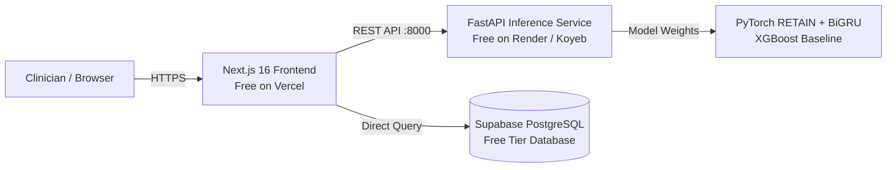

# Clinical ML Model & Web Application Deployment Guide

This guide provides step-by-step instructions for hosting the **Chronic Disease AI Inference Microservice** (FastAPI + PyTorch + XGBoost), the **Clinical Web Portal** (Next.js 16), and the **Longitudinal EHR Database** (Supabase PostgreSQL) — with a strong focus on **100% Free & Zero-Card Options**.

---

## 🏗 System Architecture Overview



---

## 💡 Quick Comparison: 100% Free Hosting Options

| Platform | Type | Cost | Docker Required? | Notes |
| :--- | :--- | :--- | :--- | :--- |
| **[Render.com](https://render.com)** ⭐ *(Recommended for API)* | REST API (FastAPI) | **100% Free** | **No** (Native Python) | Auto-deploys from GitHub using `render.yaml` |
| **[Hugging Face Spaces](https://huggingface.co/spaces)** | Interactive Dashboard | **100% Free** (16GB RAM) | **No** (Use Streamlit SDK) | `app.py` in repo runs out-of-the-box |
| **[Koyeb](https://koyeb.com)** | REST API | **100% Free** | No | 512MB RAM Eco tier |
| **[Vercel](https://vercel.com)** | Frontend (Next.js) | **100% Free** | No | Global CDN edge network |
| **[Supabase](https://supabase.com)** | Database (PostgreSQL) | **100% Free** | No | 500MB DB with automated API & Auth |

> [!IMPORTANT]
> **Why Hugging Face Docker SDK is Paid:**
> Hugging Face recently restricted the custom **Docker SDK** to paid tiers (PRO accounts / billing verification). However, their **Streamlit SDK** and **Gradio SDK** remain **100% Free** with 2 vCPU and 16 GB RAM! If you want to use Hugging Face for free, simply select the **Streamlit** SDK instead of Docker.

---

## 🚀 1. Host the FastAPI ML API (100% Free on Render.com)

Render allows you to host the FastAPI REST microservice on their native Python runtime without needing Docker or a credit card.

### Step-by-Step Instructions:
1. Push this repository to your GitHub account.
2. Sign in to [render.com](https://render.com) using your GitHub account.
3. Click **New +** → **Blueprint** (or **Web Service**).
4. Select your repository.
5. Render will automatically read [`render.yaml`](render.yaml) from this repository and configure:
   - **Runtime**: `Python 3`
   - **Build Command**: `pip install --upgrade pip && pip install -r requirements.txt`
   - **Start Command**: `uvicorn src.api.main:app --host 0.0.0.0 --port $PORT`
   - **Plan**: `Free`
6. Click **Apply / Create Web Service**.
7. Once built, Render will assign a public HTTPS URL:
   ```text
   https://chronic-disease-ai-api.onrender.com
   ```
8. Verify the API by visiting:
   `https://chronic-disease-ai-api.onrender.com/docs` (Interactive OpenAPI Swagger UI)

---

## 🤗 2. Host the Clinical Dashboard (100% Free on Hugging Face Spaces)

To avoid the paid Docker SDK on Hugging Face, use the **Streamlit SDK**, which is completely free with 16 GB of memory.

### Step-by-Step Instructions:
1. Go to [huggingface.co/spaces](https://huggingface.co/spaces) and click **Create new Space**.
2. Set Space Name: `chronic-disease-ai`.
3. **Space SDK**: Select **Streamlit** ⚠️ *(Do NOT select Docker)*.
4. **Space Hardware**: Select **CPU basic (2 vCPU, 16GB RAM, Free)**.
5. Click **Create Space**.
6. Push this repository to Hugging Face:
   ```powershell
   git remote add hf https://huggingface.co/spaces/<YOUR_HF_USERNAME>/chronic-disease-ai
   git push hf main
   ```
7. Hugging Face will automatically detect [`app.py`](app.py) in the root directory and launch the full interactive clinical decision-support portal!

---

## 🌐 3. Host the Next.js Frontend (100% Free on Vercel)

1. Sign up or log in to [vercel.com](https://vercel.com) with GitHub.
2. Click **Add New...** → **Project** → Import your repository.
3. Set **Root Directory** to `frontend`.
4. Add the following **Environment Variables**:
   ```env
   NEXT_PUBLIC_API_URL=https://chronic-disease-ai-api.onrender.com
   NEXT_PUBLIC_SUPABASE_URL=https://qnjyvywkkctaocnvszwr.supabase.co
   NEXT_PUBLIC_SUPABASE_ANON_KEY=eyJhbGciOiJIUzI1NiIsInR5cCI6IkpXVCJ9...
   ```
5. Click **Deploy**. Your custom Next.js portal is live globally on Vercel with free SSL.

---

## 🗄 4. Connect Supabase Database (100% Free)

1. Navigate to your [Supabase SQL Editor](https://supabase.com/dashboard/project/qnjyvywkkctaocnvszwr).
2. Paste and run [`scripts/supabase_schema.sql`](scripts/supabase_schema.sql) to generate the tables (`patients`, `patient_visits`, `model_predictions`, `clinical_alerts`) with Row-Level Security.
3. (Optional) Run the local migration script to load sample cohorts:
   ```bash
   python scripts/migrate_to_supabase.py
   ```
